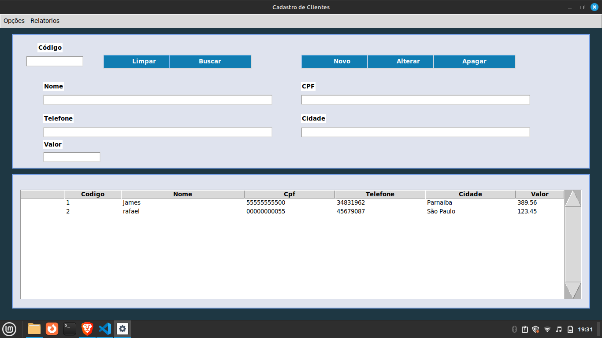

📌 Sistema de Cadastro de Clientes

Este é um sistema de gerenciamento de clientes desenvolvido em Python com Tkinter para a interface gráfica e SQLite para armazenamento de dados.

🚀 Funcionalidades

Tela de boas-vindas com animação.

Cadastro, listagem e remoção de clientes.

Banco de dados local com SQLite.

Interface intuitiva com tema escuro.

🛠 Tecnologias Utilizadas

Python

Tkinter

SQLite
